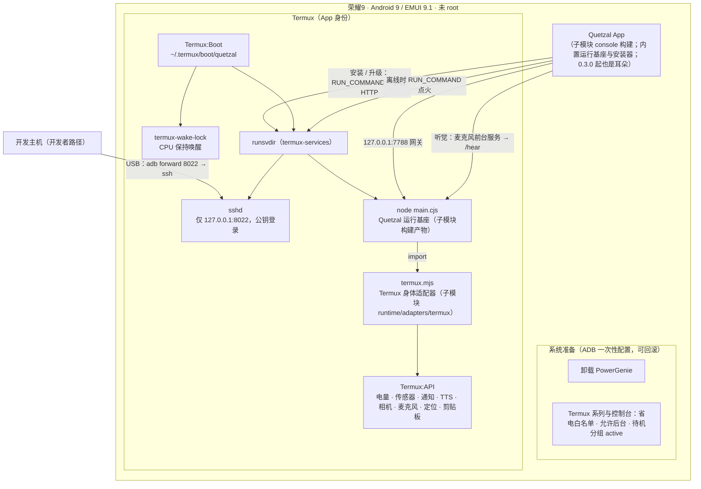
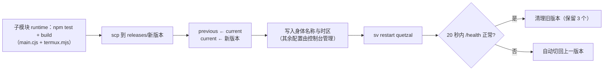

# 架构：把 Quetzal 运行基座适配到荣耀9

Quetzal 运行基座的设计与实现在子模块 [`Project.Quetzal/`](https://github.com/PlutoKeating/Project.Quetzal)（原理见其 `docs/ARCHITECTURE.md`），任意安卓手机通用的 Termux 身体适配器（`runtime/adapters/termux`）与带安装向导的 App 也在那里。本仓库只负责**这台荣耀9 特有的部分**：系统准备（EMUI 查杀）、开发者从主机经 ADB/ssh 的部署与运维、设备档案与实验记录。本仓库不修改子模块内的任何代码，只通过环境变量与家目录中的配置对接；设备端的目录与服务约定与 App 安装器完全一致。

## 1. 分层



| 层 | 作用 | 原理 |
|---|---|---|
| 系统准备 | 不被 EMUI 查杀 | EMUI 9 的 PowerGenie 会无视唤醒锁和前台服务，杀掉不在华为白名单里的后台应用，而这个白名单用户改不了，所以直接卸载它（`pm uninstall -k --user 0`，重启后保持，可用 `install-existing` 恢复）。省电白名单让 Doze 期间唤醒锁与网络仍然有效；允许后台与待机分组避免限流。 |
| Termux | 运行环境 | 原生 arm64 bionic 程序，无虚拟化开销；有会话时运行前台服务，系统视其为用户可感知进程。Node.js 24 由 `pkg` 提供，自带 `node:sqlite`。 |
| 开机自启 | 重启后不需要人 | Termux:Boot 接收开机广播，执行 `~/.termux/boot/quetzal`：持有唤醒锁并启动 runit。 |
| 守护 | 崩溃立即恢复 | runit 监视 `$PREFIX/var/service/quetzal`，进程退出即重新执行 `run`；日志交给 `svlogd` 自动轮转（`$PREFIX/var/log/sv/quetzal/`）。连续崩溃的熔断在运行基座内部。 |
| 身体适配器 | 设备的感官与动作 | 子模块的 Termux 适配器：调用 Termux:API 命令行工具，传感器按名字探测（这台机上是 BH1745 光线与 BMI160 加速度），机型只作描述。 |
| 运维通道 | 部署、诊断（开发者） | `adb shell` 读不到 Termux 私有目录，因此通过 USB 端口转发 ssh 进入 Termux。端口不对局域网开放。 |
| Quetzal App | 安装、观察、管理、听 | 与运行基座同在手机上，连本机网关；内置运行基座与 Termux 适配器，安装向导通过 Termux RUN_COMMAND 执行安装脚本（`Project.Quetzal/console/assets/install/install.sh`），离线时同一接口重新执行开机脚本点火。App 自身也能一键更新（问 GitHub 最新正式版、下载 APK、核对 SHA256、交给系统安装器；新 App 打开后直接进向导把运行基座升上去），不再需要从主机 adb 装 APK。0.3.0 起 App 还是这具身体的**耳朵**：Android 9 只允许前台服务常驻拿麦克风，Termux:API 的录音只能定长录文件，所以听觉放在 App 的原生前台服务里（系统降噪 + WebRTC VAD 断句），每句话 POST 到基座 `/hear`，由基座用 Azure 识别后以「环境声音」交给 Amani 判断是否回应。 |

## 2. 设备上的目录

```
~/.termux/boot/quetzal                  开机脚本（scripts/deploy/termux/boot-quetzal）
~/.termux/termux.properties           allow-external-apps=true（允许控制台点火）
$PREFIX/var/service/quetzal/run         runit 服务（scripts/deploy/termux/quetzal-run）
$PREFIX/var/log/sv/quetzal/current      运行日志
~/quetzal/                              QUETZAL_HOME（结构见 Project.Quetzal 文档）
~/quetzal/vault/                        保密库：你通过 pass_secret 保密输入的令牌、密码（0700/0600，只在这台手机上）
~/quetzal/tools/<名>/                   Amani 自己造的工具的实现（tool.json + tool.sh | tool.mjs，只在这台手机上；意图文档在灵魂仓库 skills/）
~/quetzal/releases/<版本>/              main.cjs、termux.mjs（ssh 发布为 <时间>-<提交>，并多一个 main.cjs.map；App 安装为运行基座版本号）
~/quetzal/current → releases/…          正在运行的版本
~/quetzal/previous → releases/…         上一个版本（回滚用）
```

## 3. 发布流程（开发者路径；使用者路径是 App 的安装向导，步骤相同，由 Termux 内的脚本执行）



## 4. 已知限制

- **重启后需要解锁一次**：这台手机设置了锁屏密码，Android 9 的文件级加密（FBE）要求首次解锁后 Termux 的数据目录才可用，Termux:Boot 也在此之后才收到开机广播。所以手机重启后，Quetzal 运行基座在你第一次解锁屏幕后自动启动。
- **Doze 在重启后恢复**：EMUI 开机会恢复 Doze；Termux 已在省电白名单中，不影响唤醒锁与网络。
- **充电上限**：`/sys/class/power_supply` 与华为充电节点对 shell 与应用都不可写，未 root 时无法设置 75% 停充。
- **操作屏幕与其他应用**（hands）：尚未实现，接口已预留，需要无障碍服务或 shell 身份。
- **听觉与 `record_audio` 共用麦克风**：Android 9 不允许两个应用同时录音，App 的耳朵开着时 Termux:API 的 `record_audio` 可能录到静音；需要她录音时先在「听觉」里关掉。耳朵的前台服务依赖 App 进程，重启手机后要打开一次 App 才会重新开始听（Android 9 没有「后台启动麦克风服务」的限制，但 App 本身不自启）。
